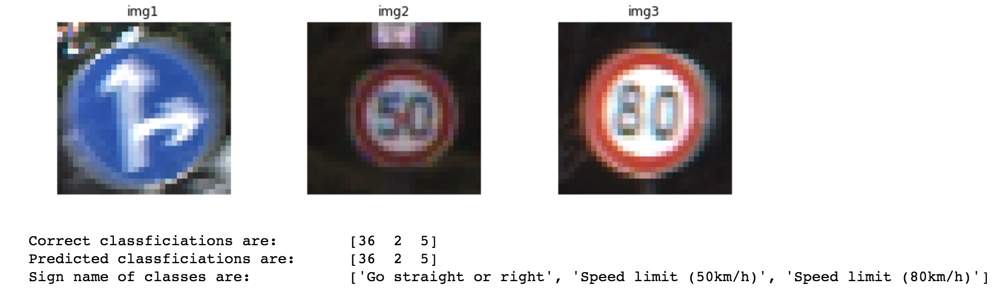
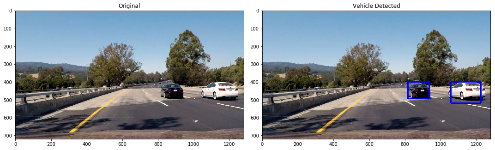

# selfdriving_projects

This repository is a summary of my independent projects on topics in selfdriving. 
Through following projects I have touched on topics in computer vision, deep learning, LIDAR/RADAR sensors, Motion Planning, PID Control, Kalman Filterings, and more. 

### 1. Traffic Sign Classifier

* Trained CNN model in tensorflow to successfully classify traffic signs \
https://github.com/MoonKang/Traffic_Sign_Classifier

### 2. Selfdriving Simulation

* Developed CNN deep learning archictecture in keras to train for steer angles of car in simulation
https://github.com/MoonKang/selfdriving_simulation

### 3. Lane Detection

* Applied computer vision methods, such as distortion correction, filtering, image rectification, color transform in OpenCV to identify lanes robustly
https://github.com/MoonKang/Robust_LaneDetection 

### 4. Vehicle Detection

* Extracted key features using HOG gradient, color space in OpenCV
* Trained SVM model to detect and track vehicles in image and video
https://github.com/MoonKang/Vehicle_Detection

### 5. Object Detection using sensor data
* With use of Lidar and Radar sensor data estimate position of nearby objects by applyig Kalman Filtering

### 6. Localization
* Localize the position of car based on map and sensor data
